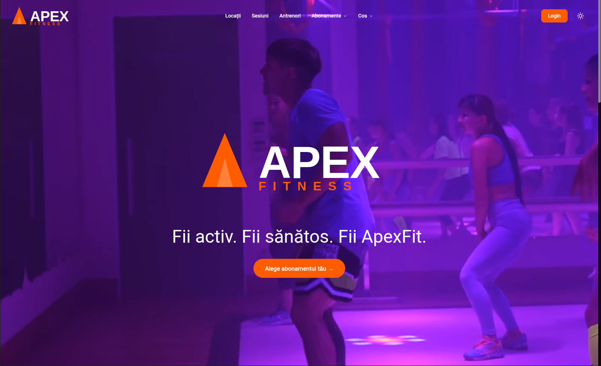

# PrimaGym



Website pentru sala de fitness PrimaGym din Satu Mare. Construit cu Next.js 14 App Router, TypeScript, Tailwind CSS și SCSS.

## Tech Stack

- **Framework:** Next.js 14 (App Router)
- **Language:** TypeScript
- **Styling:** Tailwind CSS + SCSS
- **Auth:** Auth.js (Google OAuth, Email/Parolă)
- **Database:** Neon (PostgreSQL) + Prisma
- **Payments:** Stripe
- **Deployment:** Vercel

## Features

| Feature | Status |
|---|---|
| Abonamente | ✅ Done |
| Cos (Cart) | ✅ Done |
| Galerie | ✅ Done |
| Home | ✅ Done |
| Locatie | ✅ Done |
| Navbar | ✅ Done |
| Footer | ✅ Done |
| Dark Mode | ✅ Done |
| Auth | 🚧 In Progress |
| Antrenori | 🚧 In Progress |
| Booking Sesiuni | 🚧 In Progress |
| Locatii | 🚧 In Progress |
| Profil | 🚧 In Progress |
| QR Acces | 🚧 In Progress |

## Getting Started

```bash
npm install
npm run dev
```

Aplicația rulează pe [http://localhost:3000](http://localhost:3000).
